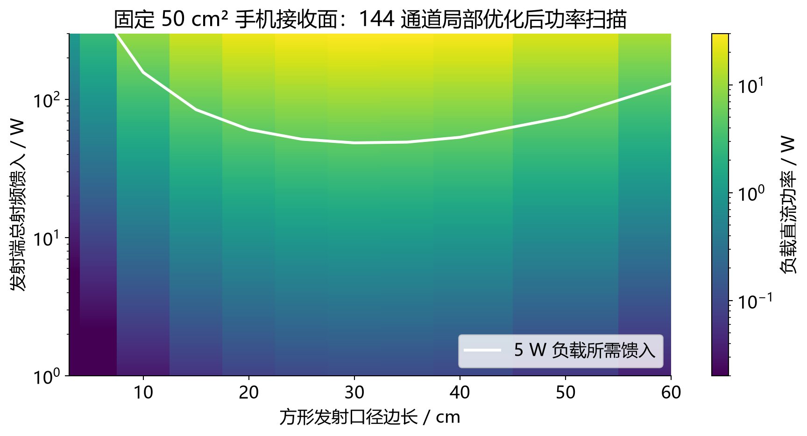
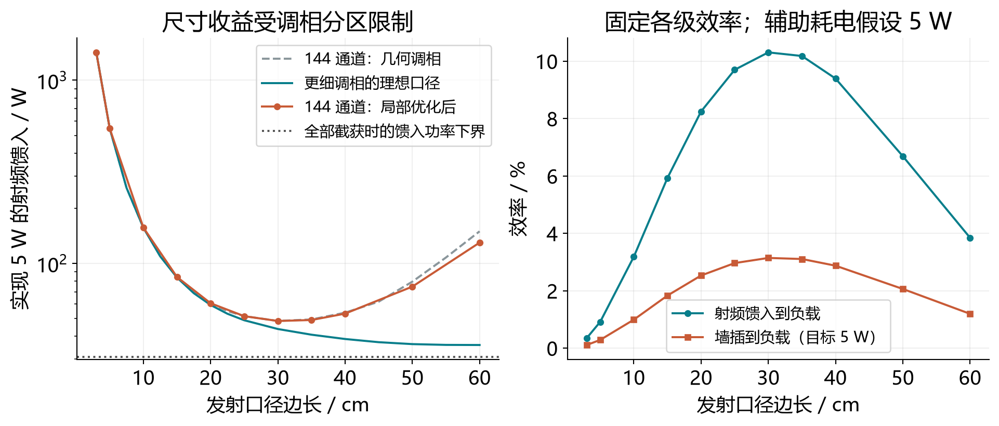
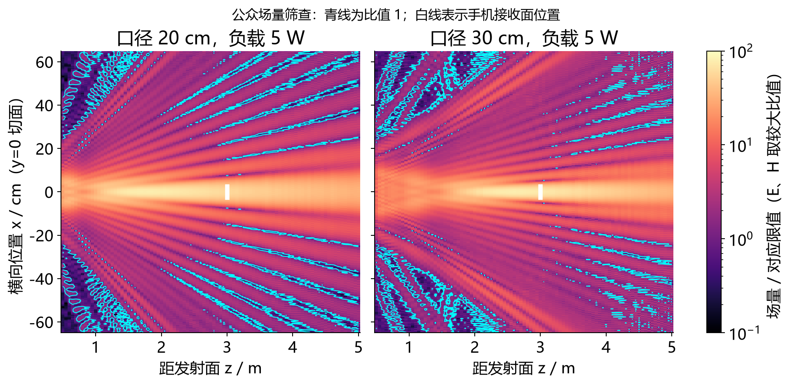
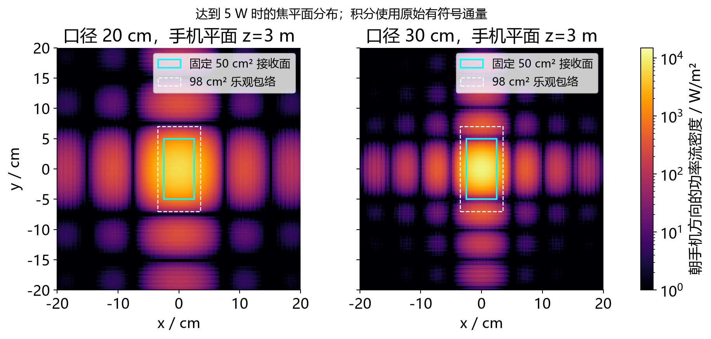

# XM-WPT：小米隔空充电思路的定向聚焦仿真

**固定普通手机能部署的接收面积，利用信标定位和调相，只改变发射端口径与射频馈入功率，能否在数米距离提供 5 W？**

本项目围绕“定位—调相—定向传能”建立可复现的 Python 模型，分别检查能量预算、有限通道数的影响和公众环境场强约束。这里的参数是研究假设，**不是小米官方代码、样机参数复原或性能实测**。

**先看结果：**在 60 GHz、50 cm² 接收面、3 m 距离和本文效率假设下，11 个口径采样中，144 通道局部优化候选的最低馈入需求出现在 **30 cm 方形口径**：约 **48.5 W 射频馈入、159 W 墙插输入、3.15% 墙插效率**，可对应 5 W 负载。但所需场强超过本项目设置的公众环境筛查值，手机端整流和电源管理损耗还约有 **6.11 W**。

因此，定向聚焦能显著改善能量预算；**在本文模型和所检验波束下，若超限区域可被公众进入，就不能同时满足持续 5 W 供电与所设环境场量限制。**这不是对小米所有可能实现方案的否定，也不是产品合规认证结论。

> **5 W 的含义：**接收端电源管理之后可向负载提供的功率，未扣除手机自身运行功耗，不等于电池净充电功率。

## 导航

- [研究场景与方法](#研究场景与方法)
- [关键结果与配图](#关键结果与配图)
- [复现方法](#复现方法)
- [命令一览](#命令一览)
- [代码与数据](#代码与数据)
- [模型边界与后续工作](#模型边界与后续工作)
- [历史清理](#历史清理)

## 研究场景与方法

感应耦合、磁共振耦合和辐射式传能对应不同的距离与硬件条件。本项目研究毫米波辐射式传能：发射口径把能量集中到手机接收面，再由接收与整流电路转换成直流功率。辐射式传能也可以工作在辐射近场，不能直接用远场链路公式替代聚焦计算。

### 固定手机，调整发射端

| 参数 | 默认设定 | 如何理解 |
|---|---|---|
| 载频、目标距离 | 60 GHz、3 m | 代表性场景，并非已确认的小米载频 |
| 手机接收面 | 5 cm × 10 cm = 50 cm² | 正对发射端、静止、无遮挡；主扫描中面积不变 |
| 发射口径 | 方形边长 3–60 cm | 17 个基准尺寸，其中 11 个进行局部相位优化 |
| 调相通道 | 12 × 12 = 144 路，6 bit | 每路是一个内部相位恒定的均匀方向性子口径 |
| 发射辐射、等效收能效率 | 0.60、0.60 | 分别计入发射损失，以及接收面的填充、匹配等损失 |
| 整流、电源管理效率 | 0.50、0.90 | 固定效率预算，未建整流非线性和热退化模型 |
| 电源、功放效率；辅助耗电 | 0.90、0.35；5 W | 用于计算墙插输入，辅助耗电取固定估计 |

50 cm² 是预先选定的手机面积预算，不是所有手机的硬上限；98 cm² 仅用于偏乐观的面积敏感性核查。主扫描没有通过不断放大手机接收面积来提高结果。

### 从位置到功率的计算流程

1. **按位置初始化相位。**假设信标已给出准确位置并完成通道校准，用球面传播距离补偿各通道相位；不仿真信标定位算法本身。
2. **传播并积分收能。**用矢量角谱法求取电场、磁场和法向 Poynting 通量，源端归一化到 1 W 前向辐射，再积分手机矩形内的功率。
3. **局部优化与量化。**以几何调相为单一起点，固定通道振幅，用伴随梯度提高总收能，最后量化到 64 个相位状态。
4. **换算供电与场强。**按效率链反算 5 W 负载所需馈入，分别检查电场、磁场，并分析位置偏差。

在约 5 mm 波长下，30 cm 方形口径的最大线尺寸是对角线，约为 42.4 cm；按 $2D_{\max}^2/\lambda$ 估算的远场参考距离约为 72 m，远大于目标距离 3 m。因此模型保留球面波传播与近场聚焦；接收面积已在积分中计入，不再额外乘一次由该面积推算的天线增益。

设空间截获比例为 $\kappa$，按上述效率设定：

$$
P_L=0.162\,\kappa P_{\mathrm{RF}},\qquad
P_{\mathrm{wall}}=\frac{P_{\mathrm{RF}}}{0.90\times0.35}+5\ \mathrm{W}.
$$

其中 $P_{\mathrm{RF}}$ 是总射频馈入，$P_L$ 是负载功率。**空间截获比例、射频到负载效率、墙插效率是三个不同的量。**

## 关键结果与配图

### 1. 扩大口径能降低馈入需求，但固定 144 路时并非越大越好

以下均为 3 m、50 cm² 接收面、局部优化后再做 6 bit 量化的结果，功率按达到 5 W 负载反算。

| 方形口径边长 | 射频馈入 | 墙插输入 | 墙插效率 |
|---|---:|---:|---:|
| 10 cm | 156.9 W | 503.1 W | 0.99% |
| 20 cm | 60.6 W | 197.4 W | 2.53% |
| **30 cm** | **48.5 W** | **159.0 W** | **3.15%** |
| 40 cm | 53.2 W | 173.9 W | 2.87% |
| 60 cm | 129.9 W | 417.4 W | 1.20% |

完整数值见 [口径扫描 CSV](results/focused_aperture/optimized_aperture_scan.csv)。30 cm 是本轮采样中的最佳候选，不是连续尺寸或所有相位方案的全局最优；60 cm 案例还达到了迭代上限。



**图 1｜口径与功率扫描。**固定 60 GHz、3 m、50 cm² 接收面，颜色为负载直流功率，白线为达到 5 W 的射频馈入需求。纵轴与色标均为对数尺度；超出 300 W 显示范围的需求未在图内完整显示。

### 2. 方向性与调相分辨能力需要一起考虑

固定 144 个通道时，扩大总口径也会扩大每个子口径。每个子口径内部只有一个相位，无法进一步补偿其内部的传播相位差，因此收益受到空间控制能力限制。连续细调相口径作为对照可以表现更好，但对应不同的硬件控制能力。

30 cm 候选的空间截获比例约为 **63.63%**，射频到负载效率约为 **10.31%**，墙插效率约为 **3.15%**。该点几何调相已接近局部优化结果：最终截获比例相对几何基准仅提高约 **0.0704%**，不能把从小口径到 30 cm 的全部收益归因于优化算法。

作为误差尺度对照，30 cm 候选在加密网格核查中，截获比例变化约 **0.1778%**，大于上述微小优化收益。因此，0.0704% 不能解读为已经具有实验意义的效率提升。



**图 2｜口径、相位控制与效率。**左图比较几何调相、144 路局部优化和连续细调相对照；点线是完全截获辐射能量、但保留各级转换损耗时的射频预算下界。右图区分射频到负载效率与墙插效率，后者计入固定 5 W 辅助耗电。

### 3. 达到 5 W，不代表公众可达区域满足场强限制

本项目以 GB 8702—2014 作为公众电磁环境的设计筛查依据。其 15–300 GHz 频段给出电场 **27 V/m**、磁场 **0.073 A/m**，以及远场等效平面波功率密度 2 W/m²；该频段按任意连续 6 分钟的方均根值评价，近场需要同时检查 E/H。本仿真为稳态连续传能，分别计算两种场量。[标准发布稿：表 1 及注释](https://www.mee.gov.cn/ywgz/fgbz/bz/bzwb/hxxhj/dcfsbz/201410/W020141022352826534956.pdf)

30 cm 候选达到 5 W 时，手机面各采样点的电场、磁场方均根值（RMS）的空间最大值分别约为 **1987 V/m、5.275 A/m**；这里不是时间波形的瞬时峰值，两种场量也分别统计。如果要求手机接收面所有采样点也受同样 E/H 限值约束，该候选波束缩放后的负载仅约 **0.924 mW**；这是特定波束和受电面约束下的结果，不是所有无线传能方案的通用上限。



**图 3｜传播路径场强筛查。**20 cm 和 30 cm 口径分别调整馈入至负载 5 W。颜色表示 `max(E_rms / 27, H_rms / 0.073)`，青线为比值 1，白线标出手机位置。图示为 `y = 0` 切面，不能据此划定完整三维安全边界。

该标准不直接适用于无线通信终端、家用电器对使用者的曝露评价，也不能直接充当产品质量要求。这里是选定场景下的**环境筛查**，并未完成产品适用标准判定、人体计算或正式检测。[适用范围说明](https://www.mee.gov.cn/ywgz/fgbz/bz/bzwb/hxxhj/dcfsbz/201410/W020141022352826534956.pdf)

### 4. 接收面积、定位误差与热损耗同样限制结果



**图 4｜有限接收面与焦斑。**两种口径均在 3 m 处向固定 50 cm² 接收面提供对应 5 W 的负载功率。青框为主接收面，白色虚线框为 98 cm² 乐观面积包络；颜色为朝手机方向的功率流密度。积分使用原始有符号通量，不把负值裁成零。

在 30 cm 候选、馈入保持 48.5 W、相位没有及时跟踪的条件下，手机沿 x 方向偏移会降低收能：

| 横向位置误差 | 0 cm | 1 cm | 2 cm | 5 cm |
|---|---:|---:|---:|---:|
| 负载功率 | 5.00 W | 4.61 W | 3.58 W | 0.52 W |

这项检查移动接收区域而保持既有波束不变，不是动态信标与闭环控制仿真。相同波束下把接收面扩大到 98 cm²，负载仅提高到约 **5.81 W**。数据见 [接收面敏感性结果](results/focused_aperture/receiver_sensitivity.json)。

此外，50% 整流效率和 90% 电源管理效率意味着，为交付 5 W，整流器输入端需要约 **11.11 W 射频功率**；计入 60% 等效收能效率前，穿过手机接收面的净功率约为 **18.52 W**。整流与电源管理的损耗合计约 **6.11 W**。这尚未证明普通手机能够承受相应温升；未收集的空间能量也不能全部算成手机发热。

## 复现方法

需要 **Python 3.12+**。以下命令均在本 README、`run.py` 和 `requirements.txt` 所在的**项目根目录**执行。

代码仓库：[rudykon/XM-WPT](https://github.com/rudykon/XM-WPT)。若从仓库获取代码，以包含 `run.py` 和 `requirements.txt` 的目录为运行目录。

建议使用独立虚拟环境。Windows PowerShell 可直接指定环境中的解释器：

```powershell
python -m venv .venv
.venv\Scripts\python -m pip install -r requirements.txt
.venv\Scripts\python run.py --help
.venv\Scripts\python run.py test
```

下文的 `python` 指已安装依赖的解释器。可先激活环境：Windows PowerShell 使用 `.venv\Scripts\Activate.ps1`；macOS/Linux 使用 `source .venv/bin/activate`，安装依赖使用 `python -m pip install -r requirements.txt`。

本机保留 `.deps/` 作为现有运行环境的后备，只由 `run.py` 统一加载；虚拟环境优先使用自己安装的依赖。依赖库不进入交付包。

### 使用已有结果分析或重画图

已有结果保存在 `results/focused_aperture/`，无需重新优化：

```bash
python run.py analyze
python run.py plot
```

`analyze` 重新写入两份派生分析 JSON；`plot` 只绘图，不修改数值结果。GitHub 版本的图片默认生成到 **`文档/小米隔空充电_技术方案.assets/`**；当前本地副本仍使用上一级的 `../文档/`，以 [wpt/paths.py](wpt/paths.py) 中的 `DOCUMENTS_DIR` 为准。本 README 使用 [assets/figures/](assets/figures/) 中的四张文章配图快照，二者不会自动同步。中文字体缺失时可安装 Noto Sans CJK SC 或思源黑体。

### 从头重新计算

仅复现数值与图片：

```bash
python run.py simulate
python run.py optimize
python run.py analyze
python run.py plot
```

**仅本地完整项目：**补齐报告模板后，可完整计算并生成 LaTeX 报告。GitHub 仓库未包含模板，克隆后请使用上面的四步数值流程。

```bash
python run.py all
```

`all` 依次运行基准扫描、相位优化、后处理、四张图片和 LaTeX 报告生成；加上 `--pdf` 才会编译 PDF，且不会自动打包。上述计算和生成命令**会覆盖对应生成文件**。主网格为 1024²，数值核查使用 2048²，完整计算通常需要数分钟及较充足内存。

参数入口为 [wpt/config.py](wpt/config.py)。修改参数后应从 `simulate` 重新开始，重新生成一致的数据；结果中的 `config.json` 是快照，不是程序输入，不能把旧场分布与新效率混用。

### 报告与交付物

GitHub 仓库保留报告相关 Python 源码，**不包含完整文章、LaTeX 源文档、模板或完整交付包**。`report`、`pdf`、`package` 及包含报告阶段的 `all` 需要本地完整项目。下列文件位置仅说明本地保留的材料，不是仓库内的下载入口：

- 原生模板：`wpt/templates/report.tex`
- LaTeX 报告：`paper/小米隔空充电_技术方案.tex`
- PDF 报告：`paper/小米隔空充电_技术方案_最新版.pdf`
- LaTeX 编译说明：`paper/LaTeX编译说明.txt`
- 仿真与 LaTeX 完整包：`paper/小米隔空充电_仿真与LaTeX完整包.zip`

**现有文件位置与代码默认输出位置不同。**`plot`、`report`、`pdf`、`package` 使用 `DOCUMENTS_DIR`：GitHub 版本为项目内的 `文档/`，本地旧版配置为上一级的 `../文档/`，均不会自动更新 `paper/` 中的文件。

在本地完整项目的已有结果上重新生成交付物，可依次运行 `analyze`、`plot`、`report`、`pdf`、`package`。PDF 编译需要本机安装 XeLaTeX、ctex 和 Fandol 字体。打包还要求默认输出目录中有 `LaTeX编译说明.txt`；重新打包前需将本地 `paper/` 中的说明复制到 `DOCUMENTS_DIR`。项目不再提供 Word 或 Markdown 报告生成流程。

`package` 按白名单收集代码、结果和默认文档目录中的报告及四幅报告图，不包含 `assets/figures/` 和 `paper/`。解压新生成的包后，应从包内 `文档/` 查看报告；本 README 的配图快照不随该包带入。

## 命令一览

`simulate`、`optimize`、`analyze`、`plot`、`test` 可用公开仓库复现；`report`、`pdf`、`package`、`all` 和 `all --pdf` 需要上述本地完整项目材料。

| 命令 | 用途 | 输入和输出 |
|---|---|---|
| `python run.py simulate` | 几何调相与连续口径的基准扫描、距离和网格核查 | 配置 → `summary.json`、配置快照及基准 CSV |
| `python run.py optimize` | 固定通道数的相位局部优化与 6 bit 量化 | 基准结果 → 优化 JSON/CSV、选定口径场数据 |
| `python run.py analyze` | 公众点 E/H 筛查和定位误差分析 | 已保存的场 → 两份派生 JSON |
| `python run.py plot` | 生成适合 A4 排版的四幅图 | 已保存的结果 → 四张 PNG；不修改数值数据 |
| `python run.py report` | 直接生成 LaTeX 报告 | 数值结果 + 原生 `.tex` 模板 → `.tex` 报告 |
| `python run.py pdf` | 连续编译两次并更新 PDF | 需要本机 XeLaTeX、ctex、Fandol 及已生成图片 |
| `python run.py package` | 校验并打包维护中的代码、结果和文档 | 不打包缓存、第三方库和历史归档；PDF 必须与 LaTeX 同步 |
| `python run.py test` | 检查数值算法与保存结果的一致性 | 不覆盖正式仿真结果 |
| `python run.py all` | 完整计算、后处理、绘图及 LaTeX 报告生成 | 不编译 PDF，不自动打包 |
| `python run.py all --pdf` | 完整计算、报告生成及 PDF 编译 | 包含 `all` 的全部阶段；不自动打包 |

## 代码与数据

```text
XM-WPT/
├── README.md                  # 研究摘要、关键图表与运行说明
├── run.py                     # 唯一命令入口和本机依赖兼容
├── requirements.txt           # 固定依赖版本
├── wpt/
│   ├── config.py              # 物理参数、效率和扫描设置
│   ├── paths.py               # 数据、文档、缓存路径
│   ├── model.py               # 矢量角谱传播与接收面积积分
│   ├── optimization.py        # 相位目标、伴随梯度与局部搜索
│   ├── simulation.py          # 基准/优化扫描及结果保存
│   ├── analysis.py            # 从保存场派生筛查与定位敏感性
│   ├── plots.py               # 四幅图的绘制
│   ├── report.py              # 报告生成源码，模板仅在本地保留
│   ├── publishing.py          # PDF 编译与完整包校验
│   └── cli.py                 # 命令分派
├── tests/                     # 功率守恒、梯度和结果回归
├── results/focused_aperture/
│   ├── *.json                 # 配置、汇总、筛查与敏感性结果
│   ├── *.csv                  # 口径、功率、距离与数值核查
│   └── *.npz                  # 20 cm、30 cm 优化候选的场快照
└── assets/figures/             # 本 README 的四张文章配图
```

运行相关命令后会生成 `DOCUMENTS_DIR` 指定的文档目录。`paper/`、`wpt/templates/report.tex` 和接收面积说明 `docs/receiver_assumptions.md` 仅在本地完整项目保留。`.cache/` 保存可再生的字体缓存、编译日志等临时文件；`.deps/`、`.venv/` 是本地依赖环境。

| 想查看的内容 | 文件 |
|---|---|
| 传播模型与固定接收面积积分 | [model.py](wpt/model.py) |
| 相位目标、伴随梯度与局部搜索 | [optimization.py](wpt/optimization.py) |
| 手机接收面积的假设依据 | 本文“固定手机，调整发射端”；本地另有 `docs/receiver_assumptions.md` |
| 11 个优化候选、迭代记录及相位 | [optimized_summary.json](results/focused_aperture/optimized_summary.json) |
| 口径与功率扫描 | [口径扫描](results/focused_aperture/optimized_aperture_scan.csv)、[功率扫描](results/focused_aperture/optimized_power_scan.csv) |
| 选定路径与侧向点的 E/H | [public_point_screening.json](results/focused_aperture/public_point_screening.json) |

现有 5 项测试覆盖功率守恒与切片一致性、伴随梯度、通道数与公共相位不变性、保存的 30 cm 结果及派生分析。它们支持数值实现的一致性，不等于真实硬件精度已获验证。

### 数据约定

- 参数源为 `wpt/config.py`。`results/focused_aperture/config.json` 是运行快照；绘图和后处理读取结果内的配置，避免把旧场数据套入新效率。
- 功率单位为 W，距离为 m，面积由宽、高相乘；CSV 中的效率和捕获率为 0—1 比例，显示百分数时乘 100。
- 场在源端归一化为 1 W 前向辐射功率，传播时不重新归一化；积分保留有符号法向 Poynting 通量。
- 相位约定为 exp(−iωt)，传播为 exp(+ikz·z)。接收面积已经计入积分，不再额外乘接收天线增益。

## 模型边界与后续工作

当前是等效口径的前向矢量传播模型，未模拟真实天线结构互耦、源附近倏逝场、接收结构加载反作用、室内和人体散射，也未模拟整流非线性、热退化、遮挡及动态控制。主优化目标是收能，**没有把公众可达点的 E/H 限制加入相位优化约束**。

报告模板针对本文 60 GHz、50 cm²、3 m、5 W 场景。探索其他配置时，数值模块可按配置计算，但须同步核查报告叙述、表格和标题，不能把默认报告直接当成任意参数的通用报告。

后续值得验证的方向包括：测量实际子口径方向图和相位控制能力；用整流曲线与温升替代固定效率；在真实三维公众可达空间内做约束优化；用多起点、更多口径采样及离散相位搜索检查结果的稳健性。

本 README 汇总研究摘要、关键图表与复现入口，完整推导与排版报告仅保留于本地 `paper/`，不放入公开仓库。

## 历史清理

原运行说明记录：2026-10-09 已将旧的小口径仿真、Word 生成链、旧结果与历史备份归入 `../归档/仿真代码整理前_*.zip`；旧报告另存于 `../归档/报告切换LaTeX前_*.zip`，均附 SHA-256 清单。旧入口和不再使用的报告移出工作目录，当前数值结果保留。**当前项目目录未包含上述归档目录**，这些路径仅作为历史记录保留。

阅读归档中的脚本名时，对应关系如下：`focused_aperture.py` → `simulate`；`optimize_focused_phase.py` → `optimize`；`plot_focused_aperture.py` → `analyze` + `plot`；两步旧报告生成流程已由 `report` 替代；`package_focused_report.py` → `package`。
